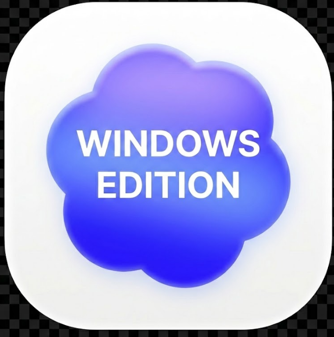
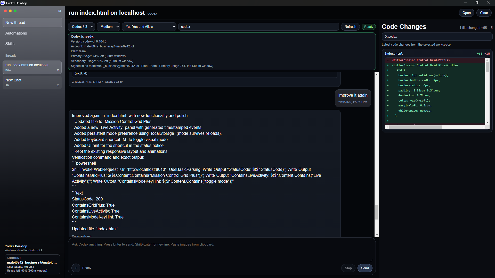

<div align="center">
  
  <h1>Desktop for Codex</h1>
  
  <p>
    <strong>A modern, native Windows GUI for the Codex CLI.</strong>
  </p>

  <p>
    <a href="https://github.com/Matei02355/desktop-for-codex/releases">Download </a> •
    <a href="#features">Features</a> •
    <a href="#development">Development</a>
  </p>

  <div align="center">
    
    
    
    <br>
    
  </div>
</div>

---


## 📸 Preview


*(The interface features a glass-morphism design, workspace file context, and transparent terminal logging)*

---

## ✨ Features

**Desktop for Codex** bridges the gap between the terminal and a modern workflow. It wraps the official CLI into a native executable, giving you a powerful UI for model selection and session management.

* **🧠 Model & Reasoning:** Instantly switch between `Codex 5.3`, `5.2`, etc., and set reasoning effort (`Low`, `Medium`, `High`).
* **🛡️ Approval Modes:**
    * `Ask Me` (Safe)
    * `Yes Yes and Allow` (Auto-execute commands for speed)
* **📂 Workspace Aware:** Built-in folder picker with a live file preview sidebar. The app automatically manages thread IDs per folder.
* **👁️ Visual Context:** Drag-and-drop image support and clipboard image pasting.
* **💻 Transparent Terminal:** See exactly what commands the agent is running on your machine (via `cmd.exe`) in real-time.
* **🔄 Session Continuity:** Uses `codex exec` + `resume` to keep your flow alive across restarts.

---

## 🚀 Getting Started

### Prerequisites
1.  **Node.js 20+** installed.
2.  **Codex CLI** installed and authenticated globally:
    ```bash
    npm install -g codex-cli
    codex login
    ```

### Installation
Download the latest installer from the **[Releases](https://github.com/Matei02355/desktop-for-codex/releases)** page.

1.  Run `CodexDesktop-Setup.exe`.
2.  The app will auto-detect your `codex` command.
3.  Start coding.

---

## 🛠️ Development

If you want to modify the source code:

```bash
# Clone the repo
git clone [https://github.com/Matei02355/desktop-for-codex.git](https://github.com/Matei02355/desktop-for-codex.git)

# Install dependencies
npm install

# Run in dev mode
npm start
```

## ☕ Support the Dev

If this tool saves you time,consider buying me a coffee!

<a href="https://buymeacoffee.com/matei6942" target="_blank">
  
</a>
